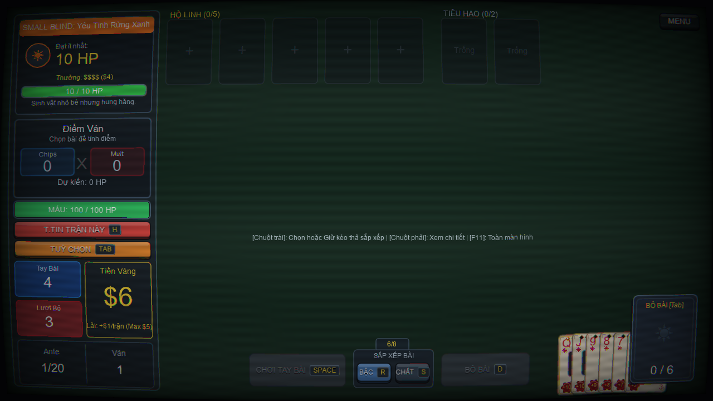
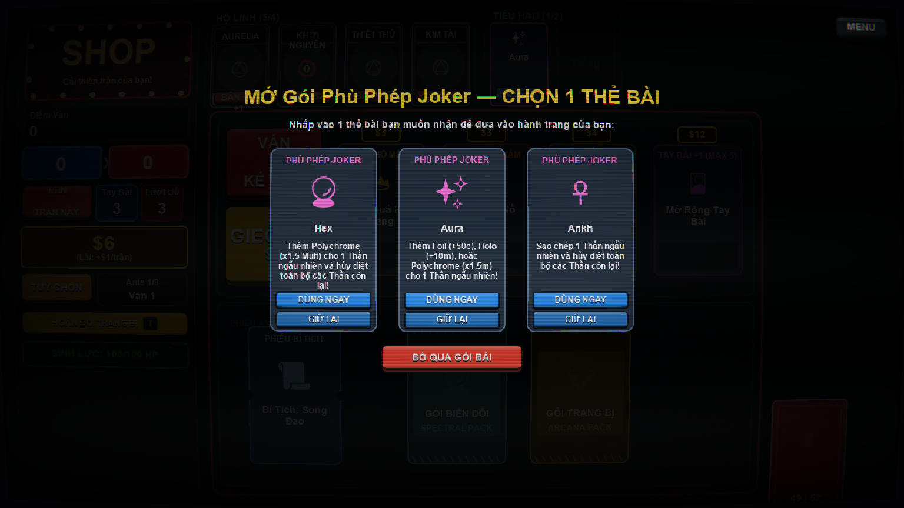
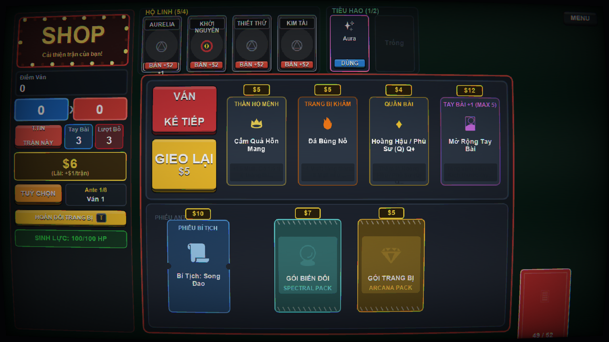
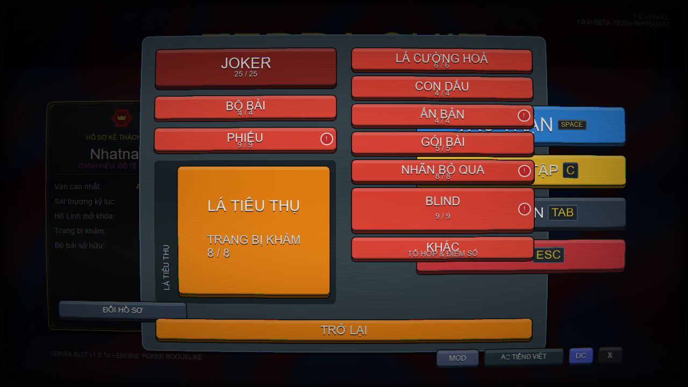
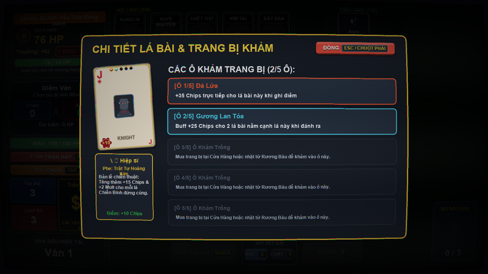
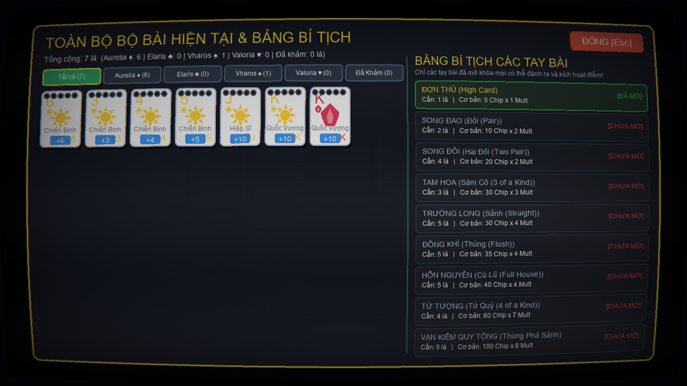
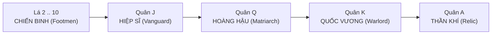
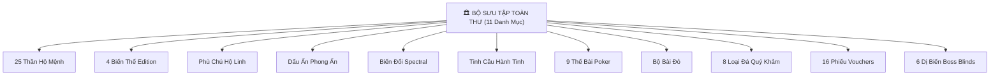

# 🃏 LUA.TCG — GRIMDARK POKER ROGUELIKE DECKBUILDER

> Một tựa game thẻ bài chiến thuật Poker Roguelike Deck-building phong cách Grimdark kỳ bí, kết hợp cơ chế tính điểm của Balatro, chiến đấu theo lượt kiểu Slay the Spire, **Bộ Bài Đỏ khởi đầu**, **Thứ Bậc Quân Chủng**, **Khảm 5 Hốc Đá Quý**, 25 **Thần Hộ Mệnh** và hệ thống vật phẩm tiêu hao.
>
> Toàn bộ trò chơi được kiến tạo 100% bằng **Lua thuần túy** và vận hành mượt mà trên nền tảng **LÖVE 2D (Love2D v11.5)**.

[](https://github.com/UIBreaker/Lua.TCG.git)
[](https://love2d.org/)
[](https://www.lua.org/)
[](test_system.lua)
[](LICENSE)

---

## 📸 Thư Viện Hình Ảnh Trực Quan (Gameplay Showcase)

| Chiến Đấu Theo Lượt & Bùng Nổ Điểm Số | Cửa Hàng & Gói Thẻ ("Dùng Ngay / Giữ Lại") |
| :---: | :---: |
|  |  |
| *Giao diện chiến đấu Grimdark, hiển thị Intent quái, thanh Hộ Mệnh & 2 ô Tiêu Hao* | *Mở Gói Booster: Lựa chọn "DÙNG NGAY" hoặc "GIỮ LẠI" vào ô Tiêu Hao* |

| Cửa Hàng Lữ Khách & Phiếu Đặc Quyền | Bộ Sưu Tập Toàn Thư (Compendium) |
| :---: | :---: |
|  |  |
| *Cửa hàng Balatro: Hàng hóa, Voucher, Booster Packs & Reroll ($5 -> $6 -> reset $5)* | *Toàn thư 11 danh mục tra cứu Thần Bài, Phù Chú, Dấu Ấn, Thế Bài & Dị Biến* |

| Soi Chi Tiết Quân Vụ & 5 Hốc Khảm Đá Quý | Toàn Bộ Bộ Bài (Deck Viewer [Tab]) |
| :---: | :---: |
|  |  |
| *Chuột phải soi chi tiết cấp bậc Quân chủng, chất bài & 5 hốc khảm bảo ngọc* | *Bấm Tab xem tỷ lệ 4 chất, thẻ bài đã khảm ngọc và bí kíp đã mở khóa* |

---

## 📑 Mục Lục Tính Năng

1. [Khởi Chạy Nhanh (Quickstart)](#-khởi-chạy-nhanh-quickstart)
2. [Bộ Bài Đỏ Khởi Đầu](#-1-bộ-bài-đỏ-khởi-đầu)
3. [Thứ Bậc Quân Chủng Thẻ Bài (Card Hierarchy & Roles)](#-2-thứ-bậc-quân-chủng-thẻ-bài-card-hierarchy--roles)
4. [Tiến Trình 8-Ante & 3-Blind (Progression System)](#-3-tiến-trình-8-ante--3-blind-progression-system)
5. [Cơ Chế Chiến Đấu Theo Lượt & Quái Vật (Combat & Intent)](#-4-cơ-chế-chiến-đấu-theo-lượt--quái-vật-combat--intent)
6. [Hệ Thống Thần Hộ Mệnh (Deities) & 4 Biến Thể Edition](#-5-hệ-thống-thần-hộ-mệnh-deities--4-biến-thể-edition)
7. [Hệ Thống Ô Tiêu Hao & Gói Thẻ Bài (Consumables & Packs)](#-6-hệ-thống-ô-tiêu-hao--gói-thẻ-bài-consumables--packs)
8. [4 Phân Lớp Thẻ Tiêu Hao (Spells, Seals, Spectrals, Planets)](#-7-4-phân-lớp-thẻ-tiêu-hao-spells-seals-spectrals-planets)
9. [Hệ Thống Khảm 5 Hốc Đá Quý (Gemstone Socketing)](#-8-hệ-thống-khảm-5-hốc-đá-quý-gemstone-socketing)
10. [Cửa Hàng Lữ Khách, Phí Reroll Tăng Dần & Vouchers](#-9-cửa-hàng-lữ-khách-phí-reroll-tăng-dần--vouchers)
11. [Bộ Sưu Tập Toàn Thư (Compendium) & Sổ Tay Thế Bài](#-10-bộ-sưu-tập-toàn-thư-compendium--sổ-tay-thế-bài)
12. [Đồ Họa Shaders, Hiệu Ứng Juice & Âm Thanh Procedural](#-11-đồ-họa-shaders-hiệu-ứng-juice--âm-thanh-procedural)
13. [Bảng Phím Tắt Điều Khiển Toàn Tập](#-12-bảng-phím-tắt-điều-khiển-toàn-tập)
14. [Cấu Trúc Thư Mục Dự Án](#-13-cấu-trúc-thư-mục-dự-án)
15. [Bộ Kiểm Thử Tự Động Toàn Diện (86/86 Unit Tests)](#-14-bộ-kiểm-thử-tự-động-toàn-diện-8686-unit-tests)

---

## 🚀 Khởi Chạy Nhanh (Quickstart)

### 1. Dành cho người dùng Windows
- **Cách 1 (Nhanh nhất - 1 Click)**: Nhấp đúp chuột vào file `run.bat` tại thư mục gốc của dự án.
- **Cách 2 (Dòng lệnh PowerShell / Terminal)**:
  ```powershell
  # Chạy game trực tiếp qua Love2D v11.5:
  ..\love-11.5-win64\love.exe .

  # Chạy bộ kiểm thử tự động (86 test cases):
  ..\love-11.5-win64\lovec.exe . --test
  ```

### 2. Tùy biến Màn hình & Tương thích
- **Toàn Màn Hình Tràn Viền (F11)**: Nhấn phím **F11** bất kỳ lúc nào để chuyển đổi tức thì giữa chế độ Cửa sổ và Toàn màn hình viền mỏng.
- **Virtual Canvas 1280x720**: Trò chơi render trên Canvas ảo độ phân giải gốc 1280x720 sắc nét, tự động scale bảo toàn tỷ lệ khung hình (Aspect Ratio) và căn giữa hoàn hảo trên mọi độ phân giải màn hình từ Full HD, 2K đến 4K.
- **Tự động lưu an toàn**: Run được lưu khi bắt đầu và sau khi rời Shop; nút Tiếp Tục tự khôi phục Ante, bộ bài, Thần, trang bị, consumable và trạng thái RNG. Settings âm lượng, tốc độ tính điểm, fullscreen và CRT cũng được lưu riêng.

---

## 🏛️ 1. Bộ Bài Đỏ Khởi Đầu

Game không còn hệ thống chọn 4 phe. Khi bắt đầu run, người chơi chọn **Bộ Bài Đỏ**:

- Bộ bài chuẩn có **52 lá**, gồm 13 lá cho mỗi chất ♠ ♥ ♦ ♣.
- Mỗi combat xáo bộ bài và chỉ rút **3 lá ngẫu nhiên** lên tay ban đầu.
- Tay bài đầu tiên của mỗi combat nhận trực tiếp **+20 Mult**.
- Chất bài chỉ phục vụ việc tạo Pair, Straight, Flush và các thế Poker; không còn kích hoạt passive phe phái.
- Các Boss khóa riêng một phe đã bị loại khỏi pool Boss.

---

## 🎖️ 2. Thứ Bậc Quân Chủng Thẻ Bài (Card Hierarchy & Roles)

Mỗi lá bài không còn là con số vô tri mà mang linh hồn của một cấp bậc quân sự trong đạo quân:



1. **Hàng Ngũ Chiến Binh (Soldiers / Footmen — Quân 2 đến 10)**:
   - Điểm số Chips tăng dần từ 2 đến 10 theo Rank.
   - Là lực lượng đông đảo làm nền tảng kết hợp các thế bài poker và nhận buff chỉ huy từ Hiệp sĩ.
2. **Hiệp Sĩ / Tiền Tuyến (Knight / Vanguard — Quân J)**:
   - Tướng tiên phong chỉ huy. Tặng thêm **+15 Chips & +2 Mult** cho **mỗi lá bài Chiến Binh (2–10)** cùng đánh ra trong tay bài.
3. **Hoàng Hậu / Ma Pháp Sư (Queen / Matriarch — Quân Q)**:
   - Ban phát ma thuật trang bị. Cung cấp trực tiếp **x1.1 XMult**, đồng thời buff thêm **+15 Chips & +2 Mult** cho mỗi viên đá quý đã khảm trên người nàng.
4. **Quốc Vương / Lãnh Chúa (King / Warlord — Quân K)**:
   - Cột trụ sát thương vương giả. Tăng cố định **+25 Chips & +5 Mult** độc lập ngay khi ghi điểm.
5. **Át Chủ Bài / Thần Khí Cổ Vật (Ace / Relic — Quân A)**:
   - Thần khí biến hóa. Cung cấp **+15 Chips**, linh hoạt đảm nhận đầu thấp (1) hoặc đầu cao (14) khi kết nối thế bài Trường Long (Straight).

---

## 🗺️ 3. Tiến Trình 8-Ante & 3-Blind (Progression System)

Trò chơi áp dụng hệ thống viễn chinh **8 Ante**, mỗi Ante bao gồm chuỗi **3 Thử Thách (Blinds)** liên tiếp:

```
[ANTE X] 
   ├── 1. Small Blind (Mục tiêu HP cơ sở)  ---> [BỎ QUA nhận TAG] hoặc [CHIẾN ĐẤU] ---> [CỬA HÀNG]
   ├── 2. Big Blind   (1.5x HP cơ sở)     ---> [BỎ QUA nhận TAG] hoặc [CHIẾN ĐẤU] ---> [CỬA HÀNG]
   └── 3. Boss Blind  (2.0x HP & Dị Biến) ---> [BẮT BUỘC ĐẤU]                      ---> [CỬA HÀNG] ---> [LÊN ANTE KẾ]
```

### 6 Dị Biến Boss Hung Tàn (Disruptive Boss Abilities)
Boss ở cuối mỗi Ante sở hữu những hiệu ứng nguyền rủa làm đảo lộn hoàn toàn chiến thuật:
- 🪡 **The Needle (Mũi Kim)**: Giới hạn nghiêm ngặt — Bạn **chỉ được phép đánh đúng 1 tay bài duy nhất** trong cả trận đấu!
- 💧 **The Water (Nước Lũ)**: Tước đoạt hỗ trợ — Khởi đầu trận đánh với **0 lượt Đổi bài (0 Discards)**!
- 🏛️ **The Pillar (Cột Trụ Cổ)**: Bào mòn uy lực — Mọi lá bài đã từng chơi trong Ante hiện tại bị suy giảm Chips.
- 🪝 **The Hook (Lưỡi Móc)**: Quấy nhiễu — Tự động vứt bỏ ngẫu nhiên 2 lá bài trên tay sau mỗi lần xuất chiêu.
- 🐟 **The Fish (Cá Biển Sâu)**: Mù lòa — Mọi lá bài rút lên sau khi đánh bài sẽ bị **Úp mặt (Face Down)**, che giấu Rank và Chất!
- 💪 **The Arm (Cánh Tay Khổng Lồ)**: Thoái hóa — Giảm vĩnh viễn **-1 Cấp độ (Level)** của thế bài bạn vừa đánh ra!

### Phần Thưởng Bỏ Qua Blind (Skip Tags)
Người chơi có thể chủ động **Bỏ Qua (Skip)** Small Blind hoặc Big Blind để nhận ngay các Huy Hiệu Đặc Quyền (Tags) như: *Túi Vàng Cực Lớn, Gói Thần Ơn Miễn Phí, Vé Làm Mới Cửa Hàng Miễn Phí, Thẻ Âm Bản Negative Cực Hiếm...*

---

## ⚔️ 4. Cơ Chế Chiến Đấu Theo Lượt & Quái Vật (Combat & Intent)

Khác với poker giải đố tĩnh thông thường, LUA.TCG mang linh hồn của một tựa game RPG chiến thuật theo lượt khốc liệt:

### 1. Ý Định Quái Vật (Monster Intent) & Giáp Bảo Hộ (Armor)
- Quái vật hiển thị rõ **Hành động kế tiếp (Intent)**: Sát thương tấn công, kỹ năng gầm thét tăng công hoặc buff khiên.
- Đánh bài tích lũy **Giáp (Armor)** cho người chơi để triệt tiêu trực tiếp sát thương đòn đánh của quái trong lượt tới.
- **Tiêu Diệt Tức Thì (Zero Counter-Attack)**: Nếu tay bài của bạn gây sát thương làm quái cạn kiệt sinh lực (HP ≤ 0), quái sẽ **CHẾT NGAY LẬP TỨC** và trận đấu kết thúc, quái hoàn toàn không có cơ hội phản đòn!

### 2. Bảo Hiểm Chống One-Shot (Anti-OneShot Protection)
- Nhằm tránh tình trạng người chơi bị đột tử bất công, sát thương từ một đòn đơn lẻ của quái bị chặn trần tối đa **45% Max HP**.
- Nếu người chơi còn trên 50% HP, không một đòn đánh nào có thể hạ gục bạn trong 1 hit, giữ lại tối thiểu 1 HP (Death Defiance).

### 3. Công Thức Tính Sát Thương Thực
$$\text{Sát Thương} = \left( \text{Base Chips} + \sum \text{Card Chips} + \sum \text{Gem Chips} + \sum \text{Deity Chips} \right) \times \left( \text{Base Mult} + \sum \text{Deity Mult} \right) \times \prod \text{XMult}$$

### 4. Thu Hoạch Chiến Lợi Phẩm (Cash Out 4 Nguồn)
Sau mỗi trận thắng, người chơi nhận vàng minh bạch từ 4 nguồn tài chính:
1. **Tiền Thưởng Blind**: Cố định theo độ khó của Blind.
2. **Lượt Đánh Còn Dư**: Nhận thêm +$1 Vàng cho mỗi lượt Hand chưa dùng.
3. **Tiền Lãi Tích Trữ (Interest)**: +$1 cho mỗi $5 đang sở hữu trong túi (mặc định tối đa +$5, có thể nâng bằng Voucher).
4. **Kỹ Năng Thần Bài / Bộ Bài**: Thưởng thêm từ Thần Kim Tài và hiệu ứng Bộ Bài Đỏ.

---

## 👑 5. Hệ Thống Thần Hộ Mệnh (Deities) & 4 Biến Thể Edition

Thần Hộ Mệnh (tương tự Jokers trong Balatro) là trái tim định hình lối chơi và các combo bùng nổ điểm số. Người chơi có thể mang theo tối đa các vị thần trên thanh Hộ Linh và **kéo thả tự do để sắp xếp thứ tự kích hoạt từ Trái sang Phải** (tối ưu: cộng Mult trước, nhân XMult sau).

### 🌟 4 Biến Thể Phiên Bản Quý Hiếm (Editions)
Mỗi Thần Bài khi xuất hiện có thể ngẫu nhiên mang các phiên bản đặc biệt:
- ⚪ **Foil (Ánh Bạc)**: Tặng thêm **+50 Chips** trực tiếp khi ghi điểm.
- 🟣 **Holographic (Ánh 7 Màu)**: Tăng thêm **+10 Mult** bùng nổ.
- 🌈 **Polychrome (Đa Sắc)**: Nhân trực tiếp **x1.5 XMult** vào tổng sát thương!
- 🖤 **Negative (Âm Bản)**: **ĐẶC BIỆT — Tự Động Tăng Thêm +1 Ô Chứa Thần Hộ Mệnh**! Giúp thanh Hộ Mệnh mở rộng linh hoạt lên **6, 7 hoặc 8 ô**, phá vỡ giới hạn 5 ô truyền thống!

### 💫 Bảng Các Thần Hộ Mệnh Tiêu Biểu Trong Số 25 Vị Thần
- **Thần Khởi Nguyên** *(Joker)*: +4 Mult vô điều kiện cho mọi thế bài.
- **Bộ bốn Thần Chất** *(Greedy / Lusty / Wrathful / Gluttonous)*: +4 Mult cho mỗi lá bài thuộc chất tương ứng ghi điểm.
- **Thần Trận Pháp** *(Sly / Wily)*: +50 Chips khi đánh các thế bài Song Đao hoặc Tam Hoa.
- **Thần Tinh Binh** *(Half Joker)*: +20 Mult cực mạnh nếu tay bài chỉ có ≤ 3 lá bài.
- **Thần Chiến Kỷ** *(Banner)*: +30 Chips cho mỗi lượt Đổi Bài (Discard) còn lại trong trận.
- **Thần Bách Hoa** *(Popcorn)*: Ban đầu +20 Mult, suy giảm dần -4 Mult sau mỗi round cho đến khi lụi tàn.
- **Thần Quả Thần Bí $\rightarrow$ Bất Diệt Cổ Thụ** *(Gros Michel $\rightarrow$ Cavendish)*: Thần Quả cho +15 Mult (tỷ lệ 1/6 tự diệt); khi diệt sẽ mở khóa Bất Diệt Cổ Thụ trong Shop với uy lực **x3.0 XMult vĩnh cửu**!
- **Thần Điệp Kích** *(Card Sharp)*: Nhân **x3.0 XMult** nếu chơi lặp lại thế bài đã từng đánh trong cùng trận.
- **Thần Phản Chiếu** *(Blueprint)*: Sao chép toàn bộ kỹ năng của Thần Hộ Mệnh đứng liền kề bên phải nó.
- **Kiên Nhẫn Thần Thụ** *(Delayed Gratification)*: Nhận thêm +$2 Vàng mỗi lượt nếu không sử dụng lượt Discard nào.

---

## 🎒 6. Hệ Thống Ô Tiêu Hao & Gói Thẻ Bài (Consumables & Packs)

Nhằm nâng cao tính tự chủ chiến thuật, trò chơi trang bị **Túi Tiêu Hao 2 Ngăn Độc Lập**:

### 1. Kích Hoạt Tức Thì Trong Trận Đánh (Mid-Blind Activation)
- 2 ô vật phẩm tiêu hao luôn ngự trị ở góc trên giao diện trận chiến.
- Người chơi có thể click trực tiếp vào ô tiêu hao bất kỳ lúc nào để: nâng cấp tay bài, thiêu hủy bài rác nhận tiền, ban hiệu ứng đặc biệt hoặc tạo thẻ cứu cánh ngay giữa trận!

### 2. Mở Gói Tiếp Viện: "DÙNG NGAY" hoặc "GIỮ LẠI"
- Khi bóc các Gói Thẻ Bài (Booster Packs) trong Cửa Hàng, người chơi không còn bị ép buộc phải xài ngay lập tức.
- Bạn có quyền lựa chọn:
  - ⚡ **DÙNG NGAY**: Kích hoạt hiệu ứng thẻ lên lá bài hoặc Hộ Linh được chỉ định ngay trong giao diện Shop.
  - 📥 **GIỮ LẠI**: Cất thẻ bài vào 1 trong 2 ô Tiêu Hao dự trữ, để dành cho những tình huống ngặt nghèo tại các trận Boss hung tợn!

---

## 🔮 7. 4 Phân Lớp Thẻ Tiêu Hao (Spells, Seals, Spectrals, Planets)

Kho tàng thẻ tiêu hao phong phú mang lại chiều sâu tùy biến vô tận cho bộ bài:

### 1. Phù Chú Hộ Linh (Joker Spells)
- **Aura (Quang Hóa)**: Ban ngẫu nhiên hiệu ứng Foil, Holo hoặc Polychrome cho 1 Thần Hộ Mệnh.
- **Ectoplasm (Ngoại Chất)**: Biến 1 Thần Hộ Mệnh thành dạng **Negative (+1 Slot Hộ Mệnh)** với cái giá đánh đổi -1 Hand Size.
- **Ankh (Tái Sinh Thần Linh)**: Nhân bản 1 Thần Hộ Mệnh ngẫu nhiên và hiến tế các Thần Hộ Mệnh khác.
- **Hex (Nguyền Rủa)**: Ban Polychrome (x1.5 XMult) cho 1 Thần Hộ Mệnh.

### 2. Dấu Ấn Thẻ Bài (Card Seals)
Đóng dấu ấn thần bí trực tiếp lên mặt lá bài:
- 🟡 **Gold Seal**: Tặng ngay **+$3 Vàng** mỗi khi lá bài này được đánh ra và tính điểm.
- 🔴 **Red Seal**: Cho phép lá bài này **Kích hoạt tính điểm lại thêm một lần nữa (Retrigger)**!
- 🔵 **Blue Seal**: Tạo ra 1 thẻ Tinh Cầu Hành Tinh ngẫu nhiên nếu lá bài này còn nằm trên tay khi kết thúc trận.
- 🟣 **Purple Seal**: Tạo ra 1 thẻ Tiêu Hao ngẫu nhiên khi lá bài này bị Đổi bài (Discard).

### 3. Biến Đổi Ma Thuật Cổ Xưa (Spectral Cards)
- **Cryptid (Nhân Bản Vô Tính)**: Chọn 1 lá bài trong tay, tạo ra thêm 2 bản sao hoàn hảo của lá bài đó vào bộ bài.
- **Immolate (Hỏa Tế)**: Thiêu hủy ngẫu nhiên 5 lá bài rác trong tay để nhận ngay **+$20 Vàng** ròng!
- **Ouija (Hồn Triệu)**: Đồng bộ hóa toàn bộ các lá bài trên tay thành cùng một Rank ngẫu nhiên (đánh đổi -1 Hand Size).
- **Black Hole (Hố Đen Vũ Trụ)**: Nuốt chửng không gian, **nâng cấp đồng loạt tất cả 9 thế bài Poker lên +1 Level**!

### 4. Tinh Cầu Thiên Thể (Celestial Planets & Hand Leveling)
Nâng cấp vĩnh viễn chỉ số sát thương nền (Base Chips & Base Mult) cho từng thế bài cụ thể:
- 🪐 **Pluto**: Nâng cấp Đơn Thủ (High Card)
- ☿️ **Mercury**: Nâng cấp Song Đao (Pair)
- ♀️ **Venus**: Nâng cấp Tam Hoa (Three of a Kind)
- ♁ **Earth**: Nâng cấp Hỗn Nguyên (Full House)
- ♂️ **Mars**: Nâng cấp Tứ Tượng (Four of a Kind)
- 🌟 **Supernova (Siêu Tân Tinh)**: Tăng vọt **+3 Level** tức thì cho thế bài được bạn sử dụng nhiều nhất trong trận đấu!

---

## 💎 8. Hệ Thống Khảm 5 Hốc Đá Quý (Gemstone Socketing)

Mỗi lá bài trong bộ bài sở hữu cấu trúc vật lý gồm **5 Hốc Khảm Đá Quý Giác Cạnh (Faceted Sockets)** với 3 trạng thái đồ họa chi tiết (Hốc Rỗng, Đã Khảm, Hiệu Ứng Phát Sáng):

| Biểu Tượng | Tên Bảo Thạch Khảm | Hiệu Ứng Khi Lá Bài Ghi Điểm Xuất Trận |
| :---: | :--- | :--- |
| 💎 | **Đá Lửa** | Tặng trực tiếp **+35 Chips** cho lá bài này. |
| 🔥 | **Đá Bùng Nổ** | Tăng thêm **+10 Mult** cho toàn bộ tay bài xuất kích. |
| 🪞 | **Gương Lan Tỏa** | Lan tỏa sức mạnh, buff thêm **+25 Chips** cho 2 lá bài nằm kế bên. |
| 🌪️ | **Mắt Bão** | Cung cấp **+3 Mult** cho tất cả các lá bài CÙNG CHẤT trong tay bài. |
| 💰 | **Đồng Tiền May Mắn** | Thưởng ngay **+$3 Vàng** vào túi tiền người chơi khi ghi điểm. |
| 🪶 | **Lông Vũ Tự Do** | Khi Đổi bài (Discard) lá này, **KHÔNG bị trừ lượt đổi bài**. |
| 🩸 | **Nhẫn Huyết Thần** | Gây thêm sát thương chuẩn tương đương **15% sát thương** trừ thẳng vào máu quái. |
| 👑 | **Ngọc Bội Thánh Tích** | Nhân bộc phát **x1.3 XMult** vào tổng sát thương tay bài! |
| 🛡️ | **Đá Hộ Mệnh** | Cộng **+5 Giáp** khi lá bài ghi điểm. |
| 🛡️ | **Ngọc Hộ Thân** | Cộng **+8 Giáp** khi lá bài ghi điểm. |
| 💚 | **Ngọc Hồi Máu** | Hồi **+2 HP** khi lá bài ghi điểm. |

> 💡 **Chuyển Đồ Trong Cửa Hàng (Shop Transfer)**: Bạn có thể tự do tháo gỡ bảo ngọc từ lá bài cũ và khảm sang lá bài mới chỉ với vài thao tác kéo chọn trực quan trong Cửa Hàng!

---

## 🏪 9. Cửa Hàng Lữ Khách, Phí Reroll Tăng Dần & Vouchers

Cửa Hàng sau mỗi trận đấu mô phỏng hoàn hảo cấu trúc thương trường của Balatro:

### 1. Phân Tầng Mặt Hàng Chuyên Biệt
- **Tầng Trên (Upper Items)**: Thần Hộ Mệnh, Lá Bài Bổ Sung, Đá Quý Khảm.
- **Tầng Giữa (Voucher Slot)**: Phiếu Đặc Quyền duy nhất mỗi Ante với năng lực vĩnh viễn (như *Mở Rộng Tay Bài +1 Hand Size, Giảm Giá Cửa Hàng, Tăng Tiền Lãi...*).
- **Tầng Dưới (Booster Packs)**: Các gói bài Tarot, Spectral, Tinh Cầu và Gói Thần Ơn.

### 2. Cơ Chế Tăng Phí Làm Mới (Incremental Shop Reroll)
- Phí Reroll cơ sở: **$5**.
- Mỗi lần nhấn Reroll trong cùng một lượt ghé thăm Shop, chi phí tăng dần: **$5 $\rightarrow$ $6 $\rightarrow$ $7...**
- Chi phí Reroll **tự động Reset về mốc $5** khi bạn tiến sang Blind tiếp theo, ngăn chặn lạm dụng vàng vô hạn!

---

## 📚 10. Bộ Sưu Tập Toàn Thư (Compendium) & Sổ Tay Thế Bài

Trò chơi tích hợp bách khoa toàn thư đầy đủ ngay trong game:



- **Sổ Tay Bí Tịch (Phím H)**: Tra cứu nhanh cấp độ, hệ số Chips x Mult hiện tại của cả 9 thế bài Poker (từ Đơn Thủ đến Vạn Kiếm Quy Tông).
- **Xem Toàn Bộ Bộ Bài (Phím Tab)**: Thống kê chi tiết số lượng thẻ theo chất, thẻ đã khảm ngọc và các bí tích đã mở khóa.

---

## 🎨 11. Đồ Họa Shaders, Hiệu Ứng Juice & Âm Thanh Procedural

- **Curved CRT Scanline Shader**: Bộ lọc màn hình CRT cổ điển tái hiện không khí máy thùng hoài niệm và bí ẩn.
- **Psychedelic Color-Cycling Shaders**: Hiệu ứng nền động huyền ảo biến chuyển màu sắc theo nhịp độ trận đánh.
- **3D Card Tilt & Balatro Buttons**: Lá bài nghiêng đa chiều theo vị trí chuột; các nút bấm có độ dày 3D (Extrusion & Depress), nhún nảy sống động khi click chuột.
- **Âm Thanh Procedural Tinh Chỉnh**: Tiếng lật bài giòn giã, tiếng leng keng vàng bạc, tiếng xé gói Booster Pack chân thực và tiếng trống báo hiệu chiến thắng hào hùng.

---

## ⌨️ 12. Bảng Phím Tắt Điều Khiển Toàn Tập

| Phím Tắt | Thao Tác Nhanh Trong Trò Chơi |
| :---: | :--- |
| **F11** | Bật / Tắt chế độ Toàn Màn Hình tràn viền (Borderless Fullscreen). |
| **Space** / **Enter** | **Xuất Chiêu** (Đánh các lá bài đã chọn) / Tua nhanh hiệu ứng cộng điểm. |
| **D** | **Đổi Bài** (Discard các lá bài đã chọn để rút bài mới). |
| **R** | Sắp xếp các lá bài trên tay theo **Cấp Bậc Quân Chủng (Rank: K $\rightarrow$ 2)**. |
| **S** | Sắp xếp các lá bài trên tay theo **chất (Suit: ♠ $\rightarrow$ ♥ $\rightarrow$ ♦ $\rightarrow$ ♣)**. |
| **Số 1 .. 9** | Chọn / Hủy chọn nhanh lá bài thứ 1 đến 9 trên tay. |
| **Chuột Phải** | Nhấp vào lá bài để mở bảng **Soi Chi Tiết Quân Vụ & 5 Hốc Khảm**. |
| **Kéo Thả Chuột** | Tự do sắp xếp thứ tự Thần Hộ Mệnh trên thanh linh vị hoặc sắp xếp lá bài trên tay. |
| **Tab** | Mở / Đóng Bảng Tổng Quan Toàn Bộ Bộ Bài (Deck Viewer). |
| **H** | Mở / Đóng nhanh Sổ Tay Thế Bài Poker (Handbook). |
| **Esc** | Tạm dừng game / Đóng các cửa sổ thông tin đang mở. |

---

## 📂 13. Cấu Trúc Thư Mục Dự Án

Kiến trúc mã nguồn được module hóa sạch sẽ và tối ưu hiệu năng:

```text
poker-roguelike/
├── conf.lua                 # Cấu hình cửa sổ Love2D (1280x720, VSync, Tiêu đề)
├── main.lua                 # Game State Machine, vòng lặp chính, Input & Renderer
├── run.bat                  # Script khởi chạy game nhanh 1-click cho Windows
├── test_system.lua          # Bộ kiểm thử hệ thống tự động 86 bài test
├── .github/workflows/       # CI chạy test tự động trên Linux
├── LICENSE                  # Giấy phép MIT
├── fonts/                   # Phông chữ Unicode hiển thị tiếng Việt hoàn mỹ
└── src/
    ├── deck.lua             # Quản lý Bộ Bài Đỏ, quân chủng, rút bài và xáo bài
    ├── combat.lua           # Khởi tạo combat dùng chung và cô lập modifier tạm thời
    ├── deities.lua          # 25 Thần Hộ Mệnh, 4 Editions (Foil, Holo, Poly, Negative +1 Slot)
    ├── equipment.lua        # 11 loại trang bị/ngọc khảm và hiệu ứng kích hoạt
    ├── events.lua           # Nội dung và kết quả các sự kiện
    ├── game_state.lua       # Schema và reset sạch trạng thái mỗi run
    ├── map.lua              # Map 20 tầng cũ dùng cho công cụ phát triển
    ├── monster.lua          # Chỉ số quái vật, Intent tấn công, phòng thủ & 6 Dị biến Boss
    ├── persistence.lua      # Save/load run và settings có version
    ├── poker.lua            # Đánh giá 9 thế bài poker & thuật toán hạ cấp thông minh
    ├── reward_system.lua    # Giao diện tổng kết chiến thắng và chọn thưởng
    ├── rng.lua              # RNG gameplay độc lập, có seed và trạng thái tái lập
    ├── run_manager.lua      # Quản lý vòng lặp 8 Ante, 3 Blind/Ante, Skip Tags & Cash Out
    ├── scoring.lua          # Động cơ tính điểm bùng nổ theo bước (Chips x Mult x XMult)
    ├── shop.lua             # Cửa hàng Balatro, Reroll tăng dần, Vouchers, Mở gói & Ô Tiêu Hao
    ├── sound.lua            # Quản lý âm thanh giao diện, âm nhạc và tiếng động FX
    └── ui.lua               # Hệ thống nút bấm Balatro 3D, thanh tiến trình & huy hiệu vector
```

---

## 🧪 14. Bộ Kiểm Thử Tự Động Toàn Diện (86/86 Unit Tests)

Dự án sở hữu bộ kiểm thử tự động toàn diện gồm **86 Unit Tests độc lập**, kiểm soát chặt chẽ từ logic toán học, tính điểm, cơ chế bài đến khả năng chịu tải runtime:

```text
=== RUNNING ROGUELIKE POKER SYSTEM TESTS ===
[PASS] 1. Encounter 1 Monster HP is 76 HP: Yêu Tinh Rừng Xanh (76 HP)
[PASS] 2. Monster HP scaling (+50% each encounter) verified: 76 -> 114 -> 171 -> 257 -> 385 HP
[PASS] 2b. Boss created with scaled HP: CHÚA QUỶ GAI GÓC (770 HP)
[PASS] 3. Starter 1-card evaluation is High Card: ĐƠN THỦ
[PASS] 4. Locked hand attempt detected and gracefully downgraded to High Card
[PASS] 5. Unlocking Song Đao allows Pair evaluation: SONG ĐAO
[PASS] 6. Act 1 Map generated with 20 floors, starter nodes available, boss on Floor 20
[PASS] 7. Map node completion unlocks connecting nodes properly
[PASS] 8. Boss Deity draft offers 2 distinct deities: Tối Thượng Thần and Thần Bùng Nổ
[PASS] 9. Shop sells Skill Books and successfully unlocks hand: pair
[PASS] 10. Selling deity refunds gold properly
[PASS] 11. Starter deck has exactly 3 random cards for all 4 Factions
[PASS] 12. Card Hierarchy verified: Chiến Binh (2-10), Hiệp Sĩ (J), Hoàng Hậu (Q), Quốc Vương (K), Thần Khí (A)
[PASS] 13. Equipment transfer between cards verified successfully
[PASS] 14. Deities.addDeity successfully adds chosen deity: Bất Diệt Cổ Thụ
[PASS] 15. Encounter deck restoration verified: cards restore to initial rank in new encounter
[PASS] 16. Card addition adds strictly to deck and not hand (prevents duplicate selection bug)
[PASS] 17. Unlocked Straight correctly plays as Straight despite sharing same suit: TRƯỜNG LONG
[PASS] 18. Handbook contains all 9 poker hands ordered by rank for Compendium view
[PASS] 19. Deck.addCardToDeck safely adds 1 card and blocks duplicates: 4 total cards
[PASS] 20. Deck.cloneCard preserves exact card id for 1:1 combat tracking
[PASS] 21. Equipment attaches to persistent deck card and clones correctly into combat
[PASS] 22. Hand card selection isolates strictly to the chosen card (no 2-card selection bug)
[PASS] 23. Aurelia Hào Quang Thánh Thiện grants x1.15 XMult in scoring
[PASS] 23b. Vharos Hơi Thở Ma Quỷ grants +40 Chips in scoring
[PASS] 23c. Knight (J) synergizes with Soldier (2-10) to grant bonus Chips and Mult
[PASS] 24. Shop equipment purchase and socketing attaches properly without being erased
[PASS] 25. Deck exhaustion defeat rule verified: played cards stay in discard pile and empty deck+hand causes Defeat
[PASS] 26. UI.drawCard renders faceted gemstone sockets and gilded frame without error
[PASS] 27. Faction Discard Buffs rebalanced cleanly: Aurelia (+6/12c, +1m), Elaris (Heal), Vharos (3/6 True Dmg), Valoria (+5/8c, +$1)
[PASS] 28. Player HP & Monster Counter-Attack verified: monster counter-attacks for 12 HP
[PASS] 29. Tiền Lãi (Interest) verified: +$1 per $5 stored, capped at +$5 per combat
[PASS] 30. Skip Blind & Tag Rewards verified: node completed with tag reward: Túi Vàng Cực Lớn
[PASS] 31. 5 Disruptive Boss Abilities verified: The Needle, The Water, The Hook, The Fish, The Arm
[PASS] 32. UI.formatNumber verified: 15 -> 15, 1250 -> 1,250, 1234567 -> 1,234,567, 1.234e12 -> 1.234e12
[PASS] 33. Hand Drag Reordering verified: cards swap indices cleanly without data loss
[PASS] 34. Text Sanitization (variation selector stripping) & Audio Volume Clamping verified
[PASS] 35. Balatro Shop Structure (Upper/Voucher/Packs), Incremental Reroll ($5 -> $6 -> $7 -> reset $5), & Pack Opening verified
[PASS] 36. Graphics Overhaul (CRT & Psychedelic Background Shaders, 3D Card Tilt, Deity Reordering) verified
[PASS] 37. Thần Khởi Nguyên verified: +4 Mult unconditional
[PASS] 38. Tứ Đại Thần Tộc verified: +4 Mult per faction card scored
[PASS] 39. Thần Trận Pháp verified: +50 Chips for tactical formations (Pair / Trips)
[PASS] 40. Thần Tinh Binh verified: +20 Mult strictly for hands <= 3 cards
[PASS] 41. Thần Chiến Kỷ verified: +30 Chips per remaining Discard (4 discards = +120 Chips)
[PASS] 42. Thần Bách Hoa verified: decaying Mult (+20 -> +16 -> ... -> extinct)
[PASS] 43. Thần Kim Tài verified: +$4 Gold on round win
[PASS] 44. Thần Quả Thần Bí & Thần Thụ Bất Diệt verified: extinction triggers Cavendish unlock & x3.0 XMult
[PASS] 45. Thần Điệp Kích verified: x3.0 XMult on repeated hand in same combat
[PASS] 46. Thần Phản Chiếu (Blueprint) verified: dynamically copies deity to right across hand and card triggers
[PASS] 47. Ante & Blind HP Progression verified: 8 Antes mathematically validated (Small 76->2040, Big 114->3060, Boss 152->4080)
[PASS] 48. RunManager.newRun & 3-Blind Ante structure verified (Small/Big canSkip, Boss debuff active)
[PASS] 49. Cash Out Calculator verified: 5 Sources (Base, Hands, Interest, Deities, Valoria +25%) and Skip mechanics
[PASS] 50. Skip Blind Tags, Free Reroll Tag, and Shop Reroll mechanics ($5 -> $6 -> reset $5) verified
[PASS] 51. Full 8-Ante Progression (3 Blinds & 3 Shops per Ante) and Ante 8 VICTORY verified
[PASS] 52. ♠️ Thiết Quân Thứ (The Iron Axiom): Chỉ Số Thép, Boss Debuff Immunity, Phalanx Progression (+100c), J♠ (+40c/soldier), Q♠ (x1.4), K♠ (+15c/unplayed), A♠ Sát Khí verified
[PASS] 53. ♥️ Giáo Hội Huyết ƯỚc (The Sanguine Covenant): +5 Mult/card, Dấu Ấn Tử Đạo (+24m, x1.45), K♥ (+100c/+25m on last hand), Q♥ (-1 rank, x1.35), A♥ Blood Gold verified
[PASS] 54. ♦️ Trật Tự Hoàng Kim (The Gilded Conclave): Kim Ngân (+$1/card), Trần Lãi Siêu Việt ($100->$25 interest), Khảm Nén Quặng (+50% stats), J♦ (+$2 steal), Q♦ (wealth xmult), K♦ (bribe rescue), A♦ (devour +15c) verified
[PASS] 55. ♣️ Bầy Nguyên Sinh (The Feral Swarm): Bầy Đàn (9-card hand), Tuần Hoàn Thể, Q♣ (4-card Straight & Flush), K♣ (x1.9 XMult & Heal 20 HP), A♣ Wild Suit, Chân Rết Nguyên Thủy (+50c/+5m) verified
[PASS] 56. Tự do sắp xếp Thần Bài (Deities Drag & Drop & Left-to-Right Scoring Order): Đặt ô bất kỳ (1..5), Hoán đổi ô, Thứ tự Trái sang Phải (+Mult trước xMult: 180 vs 84 Sát thương), Thần Phản Chiếu sao chép qua ô trống verified
[PASS] 57. Toàn bộ Vòng Lặp Màn Chơi, Đấu Small Blind, Bỏ qua Big Blind nhận Tag, Đấu Boss Debuff, Tăng Ante 1->2, Cửa Hàng & Reroll ($5->$6->$5), An toàn UTF-8 tiếng Việt verified
[PASS] 58. Bộ Sưu Tập Toàn Thư hiển thị duy nhất Bộ Bài Đỏ và toàn bộ nội dung hỗ trợ
[PASS] 59. Hệ Thống Nút Bấm Balatro 3D (Extrusion, Depress, 3D Tilt, In Hoa UTF-8 & Keycap Badges) verified 100%
[PASS] 60. Đại Tu Grimdark & Cổ Điển (Hốc Khảm Đá Quý 3 Trạng Thái, Chân Dung Gothic K-Q-J-A, Hộ Linh Tarot & Sigil Cổ Vật) verified 100%
[PASS] 61. 3-Turn Turn-Based Combat Benchmark (Armor absorption, HP healing & Zero Counter-attack on fatal hit) verified 100%
[PASS] 62. Dual Loss Condition & 3-Card Straight (TRƯỜNG LONG) verified 100%
[PASS] 63. Monster Attack Scaling verified across all 8 Antes (No One-Shot, Boss capped at 50 DMG)
[PASS] 64. Anti-OneShot Protection verified (Single hit capped to 45% max HP and death defiance above 50 HP)
[PASS] 65. 4 Fixed Financial Sources & Cash Out Formula verified 100%
[PASS] 66. Voucher Seed Money raises interest cap to $10 verified 100%
[PASS] 67. Delayed Gratification (Kiên Nhẫn Thần Thụ) Joker verified 100%
[PASS] 68. RewardSystem.draw rendering runtime safety & button layout verified 100%
[PASS] 69. Button Subtitle vertical stacking (zero text collision) verified 100%
[PASS] 70. High score & XMult screen shake clamping (< 7px) verified 100%
[PASS] 71. Endless Mode scaling and progression beyond Ante 8 verified 100%
[PASS] 72. Ante 8 Victory trigger and 2-button choice state verified 100%
[PASS] 73. Starter hand size = 3 and selectable cards limit = 1 verified 100%
[PASS] 74. Mở Rộng Tay Bài shop item ($8 -> +1 permanent Hand Size) verified 100%
[PASS] 75. Joker Editions (Foil +50c, Holo +10m, Poly x1.5m, Negative +1 Slot) verified 100%
[PASS] 76. Joker Spells (Aura, Ectoplasm, Ankh, Hex) mechanics verified 100%
[PASS] 77. Card Seals (Gold +$3, Red re-trigger, Blue, Purple) verified 100%
[PASS] 78. Spectral Transformations (Cryptid, Immolate +$20, Ouija, Black Hole) verified 100%
[PASS] 79. Hand Leveling & Planet Cards (Base scaling & Supernova +3 Lv) verified 100%
[PASS] 80. Consumables Inventory (Slots capacity = 2) verified 100%
[PASS] 81. Shop.keepPackCard (Keep Pack Cards into Consumables & Cap 2/2) verified 100%
[PASS] 82. Dynamic Negative Deity Slots (Expansion to 6+ slots, Slot 6 Scoring & Rewards) verified 100%
[PASS] 83. Boss combat modifiers are transient and The Needle no longer leaks maxHands
[PASS] 84. Versioned save/load round-trip restores run, cards, equipment and deity behavior
[PASS] 85. Fresh-run schema prevents state leaks and gameplay RNG is reproducible
[PASS] 86. Red Deck has 52 cards, draws 3 random cards and grants +20 Mult only on the first hand
=== ALL SYSTEM TESTS PASSED SUCCESSFULLY! ===
```

---

## 📜 Giấy Phép & Bản Quyền (License)

Dự án phát hành dưới giấy phép mã nguồn mở **MIT License**. Bạn có quyền tự do sử dụng, nghiên cứu, sửa đổi và phân phối theo quy định của giấy phép.

*Chúc bạn có những trải nghiệm chiến thuật đỉnh cao, nặn bài bùng nổ và chinh phục thành công cả 8 Ante của LUA.TCG!*
